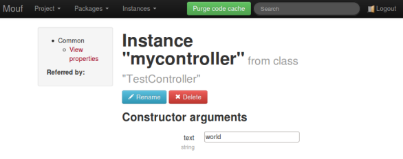

Integrating Silex with Mouf
===========================

In this example, we are using Silex and the Mouf framework as a container.

How?
----

Here is a sample about injecting a controller in Pimple.

- Install this package using Composer.
- This package depends on Mouf. Once Mouf is downloaded,
  you need to [install Mouf](http://mouf-php.com/packages/mouf/mouf/doc/installing_mouf.md).
- Then, declare a simple test controller:
  ```php
  <?php
  namespace Example\Controller;

  use Symfony\Component\HttpFoundation\JsonResponse;

  class TestController
  {
  	  private $text;
  	  public function __construct($text)
  	  {
  		  $this->text = $text;
  	  }

  	  public function testAction()
  	  {
  		  return new JsonResponse(array("hello"=>$this->text));
  	  }
  }
  ```
- [Create an instance](http://mouf-php.com/packages/mouf/mouf/version/2.0-dev/doc/mouf_di_ui.md) `mycontroller` for your controller in Mouf.
  When this is over, you should see this in Mouf UI:  
  
- Init your application using the extended `Mouf\Silex\Application` class:
  ```php
  // Load Mouf (and Composer's autoloader)
  require_once __DIR__.'/mouf/Mouf.php';

  // Get Silex app with Mouf support
  $app = new Mouf\Interop\Silex\Application(Mouf\MoufManager::getMoufManager());

  // Register Silex's controllers support
  $app->register(new Silex\Provider\ServiceControllerServiceProvider());

  // 'mycontroller' instance is declared in Mouf!
  $app->get('/hello', "mycontroller:testAction");

  $app->run();  
  ```
  
See how great it is? You can use the simple routing mechanism of Pimple and get rid of all the
spaghetti code building your dependencies.
